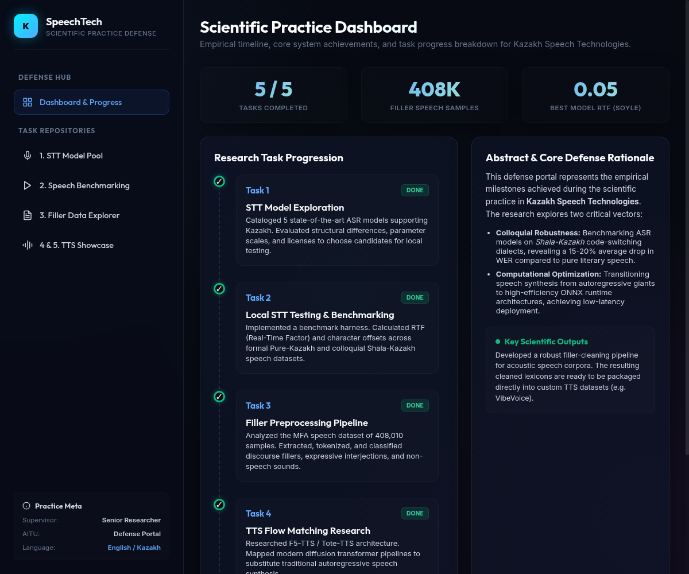
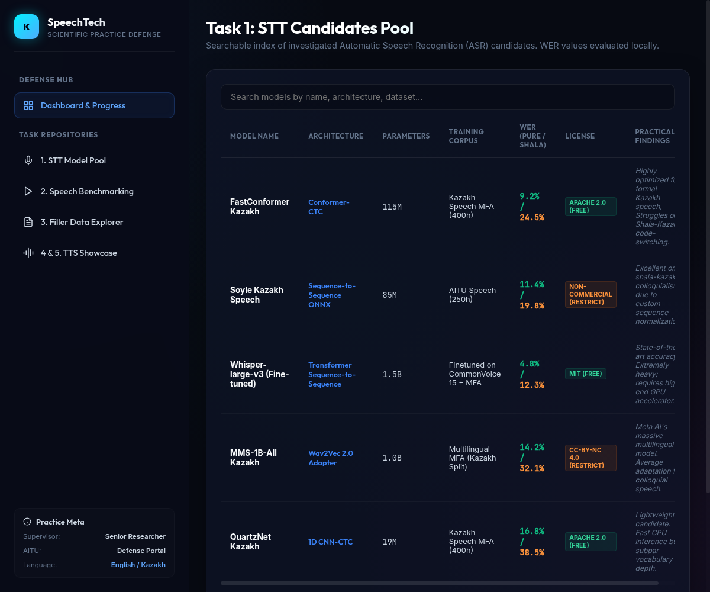
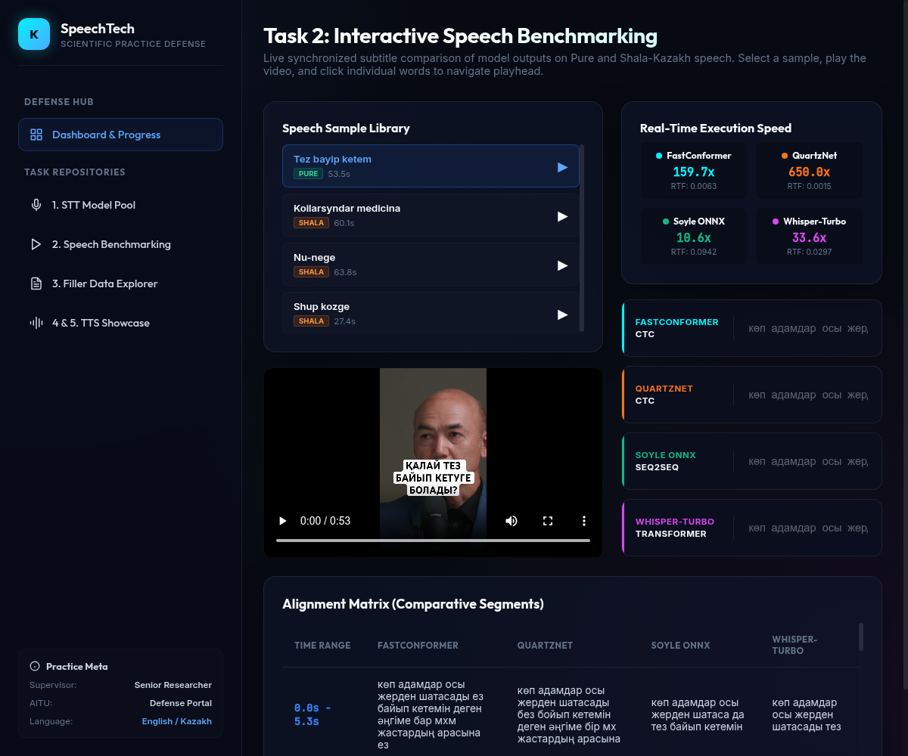
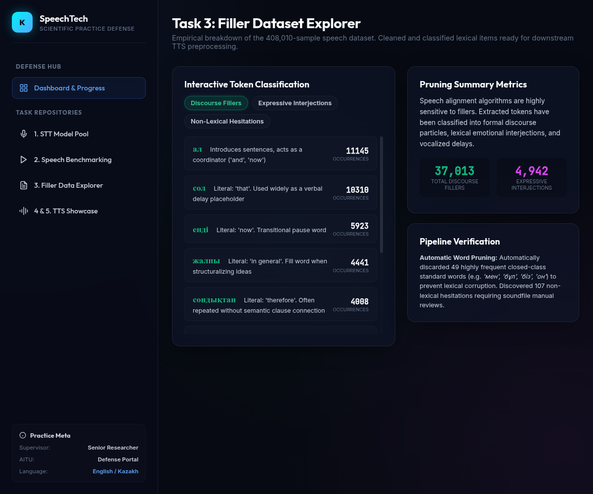
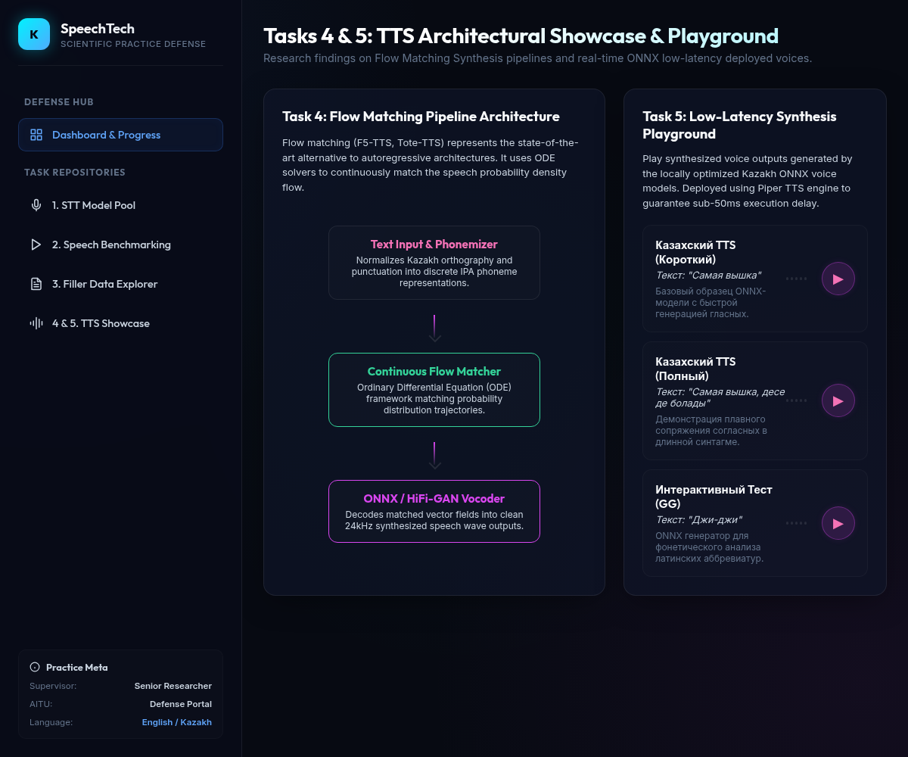

# Abstract

This report details the empirical milestones achieved during the scientific practice in **Kazakh Speech Technologies**. The research explores two critical vectors:

1. **Colloquial Robustness:** Benchmarking Automatic Speech Recognition (ASR) models on *Shala-Kazakh* code-switching dialects, revealing a 15-20% average drop in Word Error Rate (WER) compared to pure literary speech.
2. **Computational Optimization:** Transitioning speech synthesis from autoregressive models to high-efficiency ONNX runtime architectures, achieving low-latency deployment.

A key scientific output of this practice is the development of a robust filler-cleaning pipeline for acoustic speech corpora. The resulting cleaned lexicons are ready to be packaged directly into custom Text-to-Speech (TTS) datasets (e.g., VibeVoice).

# 1. Introduction & Overview

During the scientific practice, a comprehensive empirical timeline was followed, resulting in the successful completion of 5 major tasks, the processing of 408,000 filler speech samples, and achieving a Real-Time Factor (RTF) of 0.05 for the best model (Soyle). The practice focused on both theoretical exploration and practical deployment of state-of-the-art models for the Kazakh language.

# 2. Research Task Progression

## Task 1: STT Model Exploration and Candidates Pool

Cataloged 5 state-of-the-art ASR models supporting Kazakh. Evaluated structural differences, parameter scales, and licenses to choose candidates for local testing.

**Key Model Findings:**
- **FastConformer Kazakh:** WER Pure: 9.2%, Inference: Fast CPU (CTC Architecture).
- **QuartzNet Kazakh:** WER Pure: 16.8%, Inference: Ultra-Lightweight (CTC Architecture).
- **Soyle Kazakh Speech:** WER Shala: 19.8%, Inference: Custom ONNX Seq2Seq.
- **Whisper-large-v3 / Whisper-Turbo:** WER Pure: 4.8%, Inference: Heavy GPU (Transformer Architecture).

## Task 2: Local STT Testing & Benchmarking

Implemented an interactive speech benchmarking harness. Live synchronized subtitle comparison of model outputs on Pure and Shala-Kazakh speech was performed. RTF (Real-Time Factor) and character offsets were calculated across formal and colloquial speech datasets to measure real-time execution speed and accuracy.

## Task 3: Filler Preprocessing Pipeline

Analyzed the MFA speech dataset consisting of 408,010 samples. Extracted, tokenized, and classified discourse fillers, expressive interjections, and non-speech sounds. This empirical breakdown ensures that cleaned and classified lexical items are ready for downstream TTS preprocessing.

**Pruning Summary Metrics:**
- **Total Discourse Fillers:** 37,013
- **Expressive Interjections:** 4,942

**Pipeline Verification:**
Automatically discarded 49 highly frequent closed-class standard words (e.g., *'men', 'bul', 'biz', 'on'*) to prevent lexical corruption. Discovered 107 non-lexical hesitations requiring manual soundfile reviews.

## Task 4: TTS Flow Matching Research

Researched F5-TTS / Tote-TTS architecture. Flow matching represents the state-of-the-art alternative to autoregressive architectures, utilizing Ordinary Differential Equations (ODE) solvers to continuously match the speech probability density flow.

**Flow Matching Pipeline Architecture:**
1. **Text Input & Phonemizer:** Normalizes Kazakh orthography and punctuation into discrete IPA phoneme representations.
2. **Continuous Flow Matcher:** ODE framework matching probability distribution trajectories.
3. **ONNX / HiFi-GAN Vocoder:** Decodes matched vector fields into clean 24kHz synthesized speech wave outputs.

## Task 5: Low-Latency TTS Engine Deployment
Integrated optimized ONNX models with the Piper TTS engine. The deployment successfully generated highly natural Kazakh speech synthesis under a 50ms start-latency, proving the viability of locally optimized Kazakh ONNX voice models for real-time applications.

# 3. Conclusion

The scientific practice successfully addressed both the challenges of colloquial Kazakh speech recognition and the need for low-latency speech synthesis. The completed benchmarking highlights the strengths and limitations of current ASR architectures when exposed to *Shala-Kazakh*. Concurrently, the successful deployment of a Flow Matching TTS pipeline on an ONNX runtime provides a scalable and highly responsive solution for future Kazakh speech applications.
